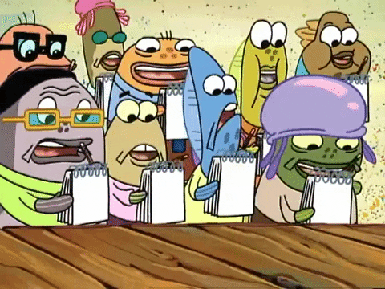

# MindPort 📝 - A portal for your thoughts

<em>&nbsp; (Tap on these notes to view the project)</em>

 

# Overview
Welcome to <strong>MindPort</strong> – a React-based notes-making app that helps you capture and organize your thoughts effortlessly. This project showcases the power of React in creating dynamic and responsive web applications. Through this project, I delved deeper into state management and component-based architecture in React.
> This is my first project using React!

 

# Technologies Used

  

 

# Features

This project has the following features:

<ul>
    <li><strong>Create Notes:</strong> Add new notes with a title and content using a simple and intuitive interface.</li>
    <li><strong>Delete Notes:</strong> Easily delete notes when they are no longer needed.</li>
    <li><strong>Responsive Design:</strong> Ensures a seamless user experience across different devices and screen sizes.</li>
    <li><strong>Component-Based Architecture:</strong> Leverages React components to build a modular and maintainable codebase.</li>
    <li><strong>GitHub Repository:</strong> Explore the code and contribute via the project's GitHub repository.</li>
</ul>

 

# Learnings:

Here are the key learnings from the MindPort project:

<ul>
    <li><strong>React State Management:</strong> Learned to manage state effectively using React's useState hook for dynamic updates and interactions.</li>
    <li><strong>Component-Based Design:</strong> Gained experience in breaking down the UI into reusable components for better maintainability.</li>
    <li><strong>Event Handling:</strong> Enhanced skills in handling events such as form submissions and button clicks within a React application.</li>
    <li><strong>Responsive UI:</strong> Ensured the app works smoothly across various devices with responsive design techniques.</li>
    <li><strong>JavaScript Proficiency:</strong> Strengthened JavaScript skills by integrating dynamic content updates and user interactions.</li>
    <li><strong>Project Structure:</strong> Improved understanding of organizing a React project with a clear and maintainable folder structure.</li>
</ul>

 

# Conclusion
Thanks for checking out MindPort, your go-to app for organizing thoughts and ideas! This project dives into React development, state management, and component-based design to provide a smooth and efficient note-taking experience. 

Feel free to explore the code, contribute, or use it for educational purposes. Your feedback and contributions are immensely valuable.

  

  Keep noting down those ideas! 📝✨

